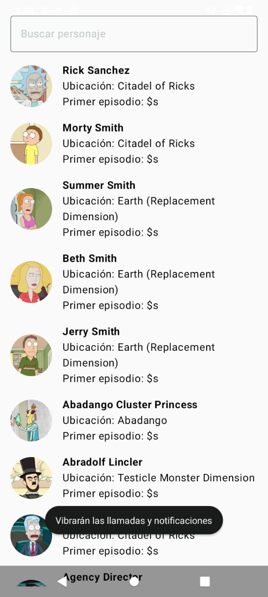
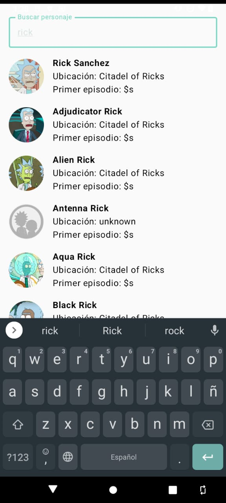
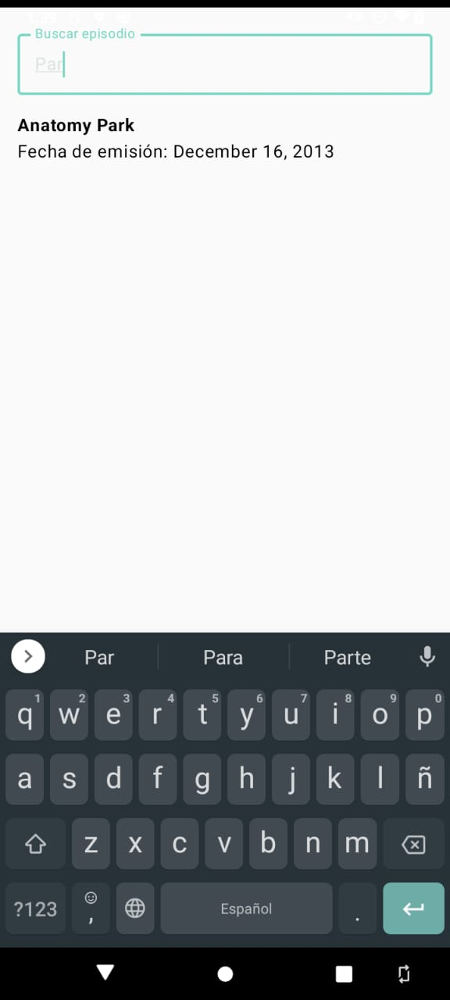
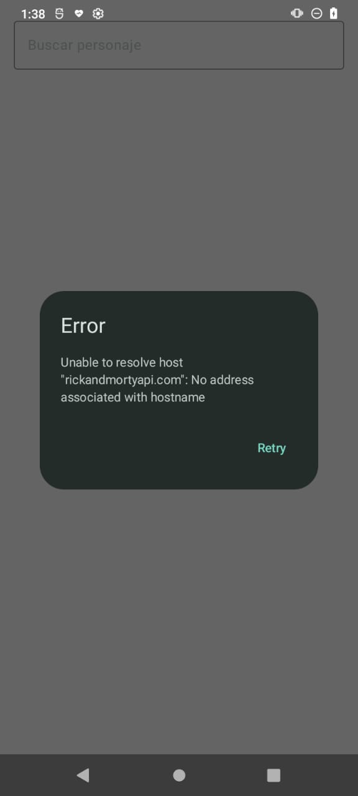
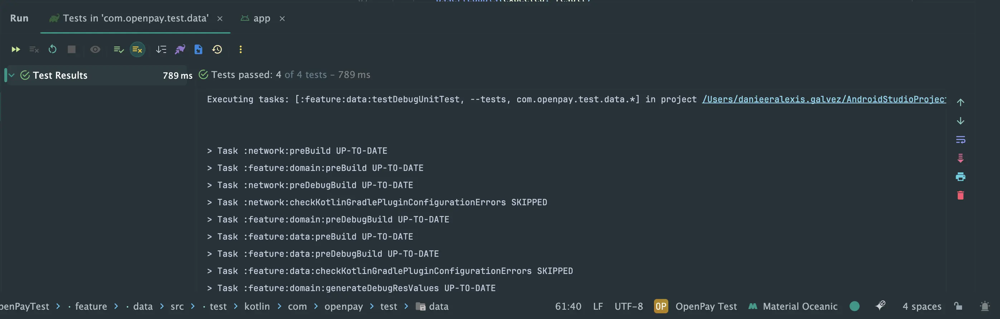
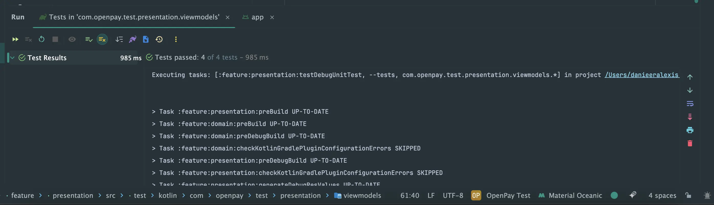
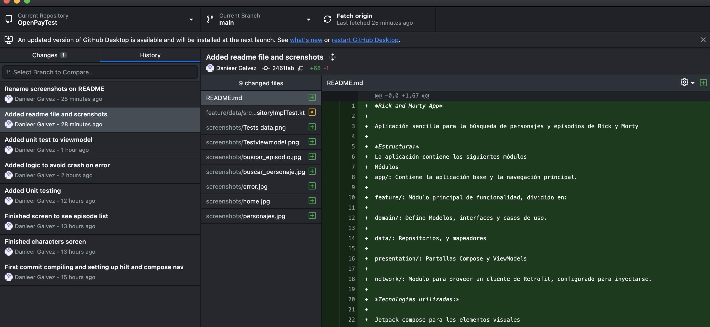
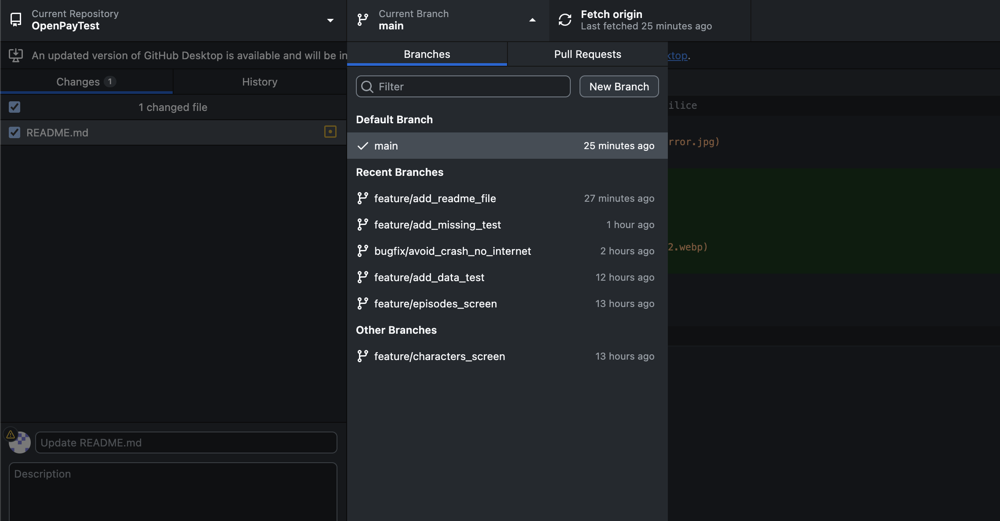

*Rick and Morty App*

Aplicación sencilla para la búsqueda de personajes y episodios de Rick y Morty.
Al final añado evidencia de los branches y commits utilizados para la aplicación, solo que tuve que
migrar el repo a mi cuenta personal ya que en la de globant no permite poner repos publicos

*Estructura:*
La aplicación contiene los siguientes módulos
Módulos
app/: Contiene la aplicación base y la navegación principal.

feature/: Módulo principal de funcionalidad, dividido en:

domain/: Defino Modelos, interfaces y casos de uso.

data/: Repositorios, y mapeadores

presentation/: Pantallas Compose y ViewModels

network/: Modulo para proveer un cliente de Retrofit, configurado para inyectarse.

*Tecnologías utilizadas:*

Jetpack compose para los elementos visuales
Jetpack Navigation compose para la navegación entre las distintas pantallas
Inyección de dependencias con Hilt:
Aquí utilice hilt para proveer las implementaciones de mis repositorios,
proveedores,cliente de retrofit, entre otros.

Retrofit + OkHttp : En el módulo network, utilice retrofit y OkHttp para configurar un interceptor
que me
permita visualizar los request en el logcat

Coil, para la carga de imágenes, este tiene integración con compose

Kotlin coroutines + stateFlow para el asincronismo

*Testing*

Para el test utilice

* JUnit
* Mock
* Turbine (pruebas de flujos)
* kotlinx-coroutines-test para pruebas de coroutines

*Capturas*

*TESTS*

*GIT*

